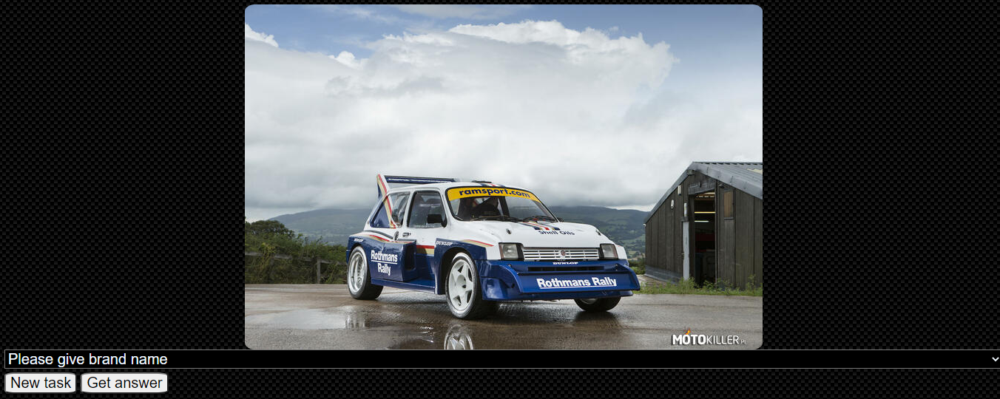

# how to run test
```
python -m pytest test
```

# how to install
```
pip3 install -r requirements.txt
```

# how to start server

```
flask run
```

# how to start server in development mode on Windows:
```
$env:FLASK_ENV = "development" ; flask run
```

